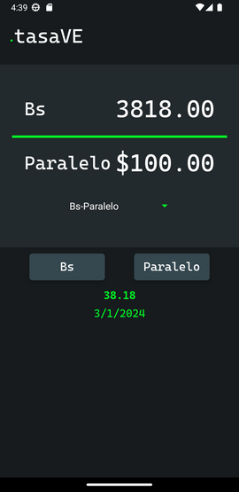

# TasaVE
Currency converter app to simplify calculations between national and foreign currencies for Venezuelans

You can access the repo for the backend [here](https://github.com/dmorenog01/tasave-native-backend)

## TODO
### Functionality

- add icon (Done)
- add splash screen
- fix rate info to make it more descriptive
- store last rates in localstorage for offline use
- Add routing and other screens (graph, rate, info pages) Expo Router
- numbers should be stored as floats and displayed as strings to preserve precision
- fix name when number is too big

### Look/Feel
- Fix Dropdown styling
- Fix Copy Buttons (Done)
- Loading animations (Done)
- Button animations (Done)
- Haptics
